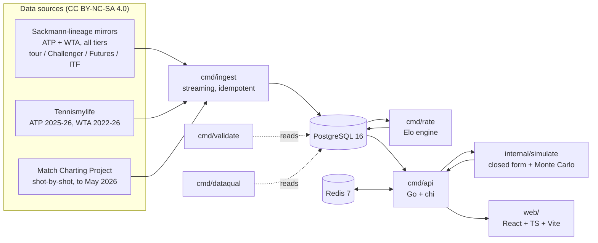

# Deucepoint

[](https://github.com/sami0076/tennis-wiki/actions/workflows/ci.yml)

Deep per-player statistics, head-to-head comparison, and first-principles match and draw
simulation for **both the ATP and WTA tours** — built from raw match data, with the
working shown.

> **Status: live, and Phases 1 to 4 are done.** Ingestion, the schema, the API, the Elo
> engine, player pages, head-to-head, rankings, search, both simulators, the methodology
> page and the Match Charting Project's per-set sheets are all deployed at
> [deucepoint.net](https://deucepoint.net), which has been up since 14 September 2026.
> Phase 5 — tournaments and seasons as pages, the draw sheet rendered, serve and return
> leaderboards, player and head-to-head splits — is built; see [Roadmap](#roadmap).

<!-- SCREENSHOT: head-to-head page. Required by the build spec §13.2 — first thing after
     the title. To be taken from the live site, at deucepoint.net/h2h. -->
_Screenshot of the head-to-head page: to be taken from the live site._

**Live URL:** [deucepoint.net](https://deucepoint.net) — API at [api.deucepoint.net](https://api.deucepoint.net/api/v1/health)

---

## Why this exists

Three things no free tennis site does well together:

- Deep per-player statistics for **ATP and WTA on the same footing**. Most sites treat the
  women's tour as an afterthought or omit it entirely.
- **Every player, not just the famous ones.** Around 1.6 million matches across tour,
  Challenger, Futures and ITF, and over 115,000 players. A player ranked 400 gets a real
  page, not an empty one — see [ADR-0003](docs/decisions/0003-full-depth-player-coverage.md).
- Head-to-head comparison with **surface, era, and form context** — not just a win-loss
  tally.
- **Match and draw simulation from first principles**, showing every intermediate step
  from point-win probability up to match probability.

The closest prior art, [Ultimate Tennis Statistics](https://github.com/mcekovic/tennis-crystal-ball),
is ATP-only. This project's differentiation is WTA parity, the simulators, and an
interface that is designed rather than assembled.

## Architecture



Go handles ingestion, rating, simulation, and the API. PostgreSQL does the statistical
heavy lifting through window functions. The frontend is a static SPA served from a CDN —
deliberately **not** in the Kubernetes cluster.

## Coverage

| Tier | Matches (approx.) | Serve statistics |
|---|---|---|
| ATP tour | 195,000 | 89% (2005) → 99% (2022) |
| ATP qualifying + Challenger | 223,000 | 0% (2005) → 99.7% (2022) |
| ATP Futures | 447,000 | none, in any year |
| WTA tour | 250,000 | 19% (2005) → 89% (2022) |
| WTA qualifying + ITF | 488,000 | effectively none |
| **Total** | **~1.63 million** | |

Over **115,000 players** across both tours. WTA records reach back to 1923.

Depth is uneven and the site is explicit about it rather than hiding it: Futures and ITF
matches support win/loss, head-to-head, and Elo but carry no point-level data, so they
cannot feed the simulator. Where a statistic does not exist, the site explains why instead
of showing a zero.

**Coverage is disclosed rather than papered over.** Full-schema data runs to within a few
weeks of the present for the ATP tour, Challenger and qualifying and for the WTA tour, and
stops in 2021 for ATP Futures and WTA ITF. The upstream repositories were withdrawn
mid-project; the lower tiers stop where the last mirror does. Filling that with
results-only data would put two data regimes in one database and produce
plausible-looking wrong numbers, so
[ADR-0006](docs/decisions/0006-accept-and-disclose-the-coverage-gap.md) accepts the gap
instead. `GET /api/v1/coverage` reports the real dates, queried from the database, so the
claim cannot drift from the data.

Full detail in [`docs/methodology.md`](docs/methodology.md) and
[`DATA_LICENSE.md`](DATA_LICENSE.md).

## Run it locally

Needs Docker and Go 1.23+.

```bash
make seed                 # Postgres + Redis, schema, and ~4,100 real matches
make api                  # http://localhost:8080
```

`make seed` takes about ten seconds. The fixture is small but deliberately covers every
data regime the site has to handle — full serve statistics, partial, never recorded at
this tier, and never recorded in this era — so the interesting behaviour is visible
immediately rather than after a full ingest. See [`testdata/README.md`](testdata/README.md).

Or step by step:

```bash
docker compose up -d      # Postgres 16 + Redis 7
make migrate-up           # apply the schema
make ingest               # load the seed fixture
```

Postgres is published on **5433** and Redis on **6380**, not the defaults, because a local
install very often already holds 5432 and 6379.

Useful targets — `make help` lists them all:

| | |
|---|---|
| `make up` | start the stack and wait until healthy |
| `make down` | stop it, keeping data |
| `make reset` | stop it and delete all data |
| `make psql` | open a shell on the database |
| `make seed` | stack, schema, and seed fixture in one |
| `make api` | run the HTTP API on port 8080 |
| `make test` | run the test suite (starts its own Postgres) |
| `make lint` | run golangci-lint |

### The API

`make ingest` then `make api`, and the read-only API is up:

```
GET /api/v1/health                        readiness, including a database round trip
GET /api/v1/coverage                      what is actually in the database, and through when
GET /api/v1/players?q=&tour=&limit=       fuzzy search, diacritic-insensitive
GET /api/v1/players/:slug                 profile and career summary
GET /api/v1/players/:slug/matches         match history, filterable and cursor-paged
GET /api/v1/players/:slug/ratings         Elo trajectory, per surface
GET /api/v1/players/:slug/rankings        published ATP/WTA ranking over time
GET /api/v1/players/:slug/clutch          break points, tiebreaks, deciding sets
GET /api/v1/players/:slug/seasons         a career a year at a time, every rate with its own count
GET /api/v1/players/:slug/highlights      runs, biggest wins, titles by level, record by round, rivals
GET /api/v1/h2h/:slug/:opponent           head-to-head, either way round
GET /api/v1/h2h/:slug/:opponent/common    every opponent both have faced, with each side's record
GET /api/v1/rankings?type=elo|official    leaderboards, as of the last week that exists
GET /api/v1/rankings/trajectory           the leaders' rating lines, for a chart
GET /api/v1/simulate/match?a=&b=          point to match, every rung of the chain
GET /api/v1/simulate/draw?event=&season=  a played draw, replayed ten thousand times
GET /api/v1/tournaments?tour=&level=&q=   the index, grouped by level, searchable
GET /api/v1/tournaments/:slug             an event across seasons, with how each got there
GET /api/v1/tournaments/:slug/:season     one edition as a draw sheet
GET /api/v1/recent?tier=&through=         the finals of the last complete week, both tours
GET /api/v1/seasons                       a row per year, both tours, with the Slam finals
GET /api/v1/seasons/:year?tour=&tier=     every event of a year at one tier, with its final
GET /api/v1/leaders/:stat?tour=&tier=&surface=&season=&min_matches=
                                          a leaderboard, with its population and every row's denominator
```

```bash
curl 'localhost:8080/api/v1/players?q=Djokovi%C4%87'
curl localhost:8080/api/v1/players/novak-djokovic
curl 'localhost:8080/api/v1/players/novak-djokovic/matches?surface=clay&season=2016'
```

The history takes `surface`, `tier`, `season` and `opponent`, and they compose. Each row
carries that player's serve line for the match, or the reason there is none.

A ranking is always **as of the last week that exists**, never today, and the response says
which week it used. Asking for a date outside coverage returns an empty page with that date
stated rather than a 404. An Elo leaderboard also drops players whose last rating is over a
year old — without that it is a list of the retired.

**The simulators show their working.** `/simulate/match` returns every rung between a point
and a match, because the amplification is the claim: a two-point edge on serve becomes a
twelve-point edge on the match. Point probabilities are derived from the ratings rather than
from per-player serve statistics — which reach 3% of the players here — and anchored on the
measured tour-and-surface average, so the response names its own inputs
([ADR-0007](docs/decisions/0007-elo-derived-point-probability.md)). A pair the model cannot
serve is an answer with a reason, not a coin flip.

`/simulate/draw` replays a draw that was actually played, with the ratings as of the week it
began, ten thousand times, and reports a confidence interval on every figure. There is no
upcoming draw to simulate and there will not be one, so the simulator does the thing the data
supports and can be scored against: Wimbledon 2019 gives Djokovic 39.9% ±1.0, and he won it.

**Under pressure is measured against a stated population.** `/clutch` reports break points
saved, tiebreaks won and deciding sets won, each against what the tour did at the same
levels in the same decades, weighted by where that player's own opportunities actually
fell -- so a Futures career is not measured against a tour average, and a career spanning
1995 and 2025 is not measured against either one alone. The population is in the response,
because a "+4" against an unnamed average is a number pretending to be a fact. Tiebreaks
and deciding sets are derived from the parsed score and the baseline is a table the ingest
rebuilds, since neither belongs in a request. Two of the three averages come out at exactly
50%, and [`docs/performance.md`](docs/performance.md) explains why that is arithmetic
rather than a finding.

The profile carries current and peak Elo for every series the player has one in — a surface
they never played is absent rather than sitting at the base rating, and a player nothing
rated has a null block rather than five 1500s.

**Redis caches the read path, and an ingest clears it.** Nothing expires on a timer: the
data only moves when an ingest runs, so that is when the cache is cleared, and the 24-hour
TTL on a key is a backstop rather than a freshness policy. A cached response lands in about
3ms whatever it cost to produce — the Elo leaderboard goes from 77ms to 3ms against a warm
Postgres, and from 842ms against a cold one. Redis being down costs time and nothing else:
every failure is a miss, the handler does the work anyway, and readiness still reports
healthy. `X-Cache` says `hit` or `miss` on every response and `/health` carries the running
hit rate, so the value is measured rather than assumed. Leave `REDIS_URL` unset and the API
runs with no cache at all, which is what every test does.

Statistics that were never recorded are reported as absent with a reason, never as zero —
see [Coverage](#coverage). Errors are RFC 7807 `problem+json`, and list responses are
cursor-paginated.

`make ingest-full` performs the complete multi-decade ingest from the configured sources.

Tests need Docker but no setup: the integration suites start a throwaway Postgres per
package, apply the migrations, and stop it afterwards. Without Docker they skip with an
explanation rather than failing. Set `TEST_DATABASE_URL` to use a server you already have;
it must be named `*test*`, because some of those tests truncate tables.
### The frontend

```bash
make web        # Vite dev server on :5173, proxying /api to the local API
make site       # the whole stack in Docker: site on :5174, API on :8080
make web-build  # tsc, eslint, vitest and a production build
```

The site is **Deucepoint**; the repository, the Go module and the compose project keep the
name `tennis-wiki`, which is an identifier rather than a brand and is not worth the churn of
renaming.

React, TypeScript and Vite under `web/`, styled with CSS Modules and custom properties.
No Tailwind, no component library, no charting library, no icon set. Every page is set as a
sheet from the tournament office: one monospaced face, ruled lines, seeds in brackets, scores
typed as the source writes them, and colour only where a value is surface-scoped. The design
record is [`DESIGN.md`](DESIGN.md), the reasoning is
[ADR-0010](docs/decisions/0010-the-draw-sheet.md), and `/_components` renders every
component in every state, which is the fastest way to check the system against a page.

`/simulator` is the third: two pickers, the chain from a service point up to the match, the
chance of each set score, one match played out game by game from the chain's serve figures
when asked (a sample of the model, with a board, a line of commentary and a tally counted
from the points it played), and a draw played ten thousand times with an interval on every
figure. The caption carries the matchup's own numbers rather than the design's, and says
where the inputs came from. The head-to-head page's "Simulate this matchup" button leads
here with both players. The page's layout and beats follow
[`docs/design/prototypes/simulator.html`](docs/design/prototypes/simulator.html).

`/tournaments/:slug/:season` is the page the design was built for: the edition as its draw
sheet. From 880px the bracket is drawn and paged the way the printed sheet is -- a 128 draw as
four quarters and then the last eight, a 56 draw as two halves and the last four, 32 and under
on one sheet -- with a name written above its rule, the pair joined at the right, the winner's
rule stepping in from the midpoint and the score under the name in the column it earned.
Below 880px it is one round at a time behind a sticky stepper. The bracket is grown back from
the results, since the files carry who beat whom and not which line anyone was on, so a seed
with no first-round match sits above a typed `bye` and a row the file lacks reads `n/r`.
`/tournaments/:slug` is every edition of an event as a row, printing how each one got there
(ADR-0012), and `/tournaments` the index grouped by level with a search. Every tournament
name on a match row links to its sheet, and the sheet's "Replay this draw" opens the
simulator on the same edition.

The home page carries last week's finals: the week that ended Sunday, as the finals of the
tour-level events that began it, both tours, each a link to the sheet and to both players,
with the date each tour's data is current to written on it. The site does not do live, and
this is the fastest way to show a visitor it is current without saying the word. An
off-season week says which week it is showing instead rather than vanishing, and a tour with
no final that week says so.

`/seasons` is the calendar a year at a time, both tours on every row since a season is the
one place the two share one: the events on each surface as the site's squares with their
counts, then the Slam champions in calendar order, and the women's rows reaching back to 1923
rather than starting where the men's files do. A year in progress says the date each tour
is complete to. `/seasons/:year` is every event of the year grouped by level, with a tier
switch so a year at Challenger level is reachable rather than silently cut.

`/leaders` is the leaderboards: one figure at a time -- eight serve figures, five return
figures, total points and the dominance ratio, and five read from the score -- filtered by
tour, tier, surface and season, every filter in the URL. The population is written above the
table (how many matches met the filter, how many had statistics, how many players clear the
floor) and every row carries the matches it stands on and the counts behind its rate, because
a first-serve rate over two matches and one over two hundred are different claims. A name
that is not in the table can be looked up, and the page says which absence it is: below the
floor, with the figure over the matches they do have, or without the figure at all. It sits
beside `/rankings` rather than in the nav, because a leaderboard is a ranking.
**The player page is a dozen cards deep, so it carries its own table of contents**: a
sticky rail under the header that tracks the section in view, every entry a real anchor so a
section is a link somebody can send. Under it the career is read four ways the rest of the
site cannot read it.

*Serve and return are two cards, not one.* A return figure is made of the opponent's serve
line, so its denominators are theirs — break points converted is the break points *they*
faced, return games won is *their* service games — and the two are counted over different
sets of matches, because a row can carry one side's line and not the other's. Below them sit
the two figures that need both at once, over the matches that carried both: total points won,
and the dominance ratio (return points won over serve points lost; 1.00 is a player who
returns exactly as well as they are returned against).

*Runs and the schedule* is the career as what happened: the longest winning run and the one
in progress, found with a gaps-and-islands window over the match list, with retirements and
walkovers left out of the sequence entirely — a run of wins broken by an opponent who never
came out has not been broken by a defeat. Beside them, the average and the highest Elo the
schedule actually faced, and the record above 2000. Every opponent carries the rating they
held the week of the match, not the one they ended their career on, so a win over a future
champion is credited with what it was worth at the time.

*Biggest wins* ranks those same wins by that rating, which is the list every career average
is an average of. *How far, and what was won* draws the record round by round as the funnel
a career actually is, scaled against the busiest round, with titles over finals reached at
each kind of event beneath it. *Most-played opponents* is who kept turning up, each row a
link to the rivalry page.

The player page cuts a career two more ways. By the opponent's ranking on the day -- the
record vs No. 1, the top 5, 10, 20, 50 and 100, outside the top 100 and unranked, the bands
nesting -- and by closeness, with the matches a final-set tiebreak decided; each is captioned
with the matches it is a record over, since a ranking is known for some matches and not
others. And year by year, one row per season with the record, titles, sets, games and
tiebreaks won, and where serve lines exist the hold, break, ace and double-fault rates and the
dominance ratio, every rate over its own count of matches: a season with four recorded matches
and sixty played is the common case in the 1990s and reads as sixty played, four recorded.
Both come from `player_totals`, rebuilt by the ingest, and were verified against a count
straight from the match rows for a long ATP career and a short WTA one.

`/h2h/:a/:b` is the comparison and `/h2h` the picker, which is the same page: the URL is the
state, so a comparison is a link somebody can send, and asking the other way round is the same
rivalry read from the other end. A rivalry argument is usually about a narrower thing, so the
cut is in the URL too: level, round, best of, surface, the meetings that went the distance,
the ones with a tiebreak, and a season range. The endpoint recomputes the record, the strip,
the serve figures and the meeting list under the cut, and the score line writes the whole
sentence -- "3-6 in finals, at Slams, of 41 meetings" -- because 3-6 is a different claim.
The deciding sets and tiebreaks between them are the rivalry's summary and are never cut. A
cut that leaves nothing is an answer naming the filter; two players who never met is a full
page, not an error.

**Through a common opponent** is the comparison a three-match rivalry cannot make. Two
players who have met three times have usually played the same few dozen people, and how each
did against that shared field says more about the matchup than three results do. Its own
request rather than a block on the comparison: it is two whole careers grouped and joined,
and the score at the top should not wait for it.

**Charts read as well as they draw.** A career line whose only legible values are its two
ends is a picture of a career rather than a record of one, so pointing at the rating history
puts a crosshair on the nearest week and writes that week's date and Elo over the line. The
same readout answers to the arrow keys and is announced politely, because "what was he rated
in 2016" should not need a mouse.

**Search is a command palette**, on ⌘K or Ctrl-K anywhere and on `/` when nothing else has
focus. A field in the header could only ever open a player page, and the best pages on this
site are comparisons; this reaches every player, every route, and both comparisons. Type a
name, press Tab, and the palette becomes "head to head against…" or "simulate a match
against…" — then search the other half and land on `/h2h/a/b`, which is otherwise two
searches on two pages. With nothing typed it offers the players this browser has actually
read, kept in local storage and nowhere else. It debounces and cancels superseded requests,
and every row carries tour, country, career match count and best tier, because at 115,000
players a name is not an identifier. `/players?q=` is the same search as a full list, and the
query and tour filter live in the URL so a search can be sent to somebody.

**A dark theme, on a three-state toggle**: follow the system, light, or dark. Three states
rather than two, because a reader who has chosen nothing is not the same as one who has
chosen the theme their machine happens to be on, and their site should keep following them
at dusk. The choice is one attribute on `<html>` and a block of custom properties; every
colour that carries meaning — the two sides of a comparison, the four surfaces, win and loss
— is lifted until it clears 4.5:1 on the panel it sits on. An inline script in `index.html`
applies a stored choice before the first paint, so nothing flashes cream on the way to dark.

**Every page carries structured data** for the crawlers that execute scripts: `WebSite`
with the player search as its search action on the root, `Person` on a player, `SportsEvent`
on an edition with the finalists as competitors, and `BreadcrumbList` on every route below
the root. Every value is copied from an API response and nothing is invented to fill a slot
the schema offers -- `SportsEvent` has a location and the files carry none, so it stays
absent -- and a test holds the `Person` to carrying no field the profile did not.

**The TypeScript types are generated from the Go response structs**, not written by hand.
`make web-types` runs [tygo](https://github.com/gzuidhof/tygo) over `internal/httpapi` into
`web/src/api/types.gen.ts`, and CI regenerates and diffs it on every change, so altering a
handler's shape without updating the client fails the build rather than the browser. Same
discipline as sqlc, one layer up.

**The absence system is three components, not one.** `AbsentCell` is a missing value in a
populated table, `PartialAggregate` is a summary over a gappy column that has to declare
its denominator, and `EmptyState` is a whole section that explains itself and points
somewhere with data. 83% of matches carry no serve statistics, so these render more often
than the numbers do; collapsing them into a falsy check would throw away the distinction
every layer below works to preserve.

`docker compose up` builds and runs the whole stack, with the API same-origin behind nginx
so the built site and the dev server behave identically. `make ingest-full` loads the
complete dataset.

## Rating methodology

Ratings are computed from scratch over every match in chronological order — no ratings
are imported from any API. Standard Elo, with a decaying K-factor so that a player's early
matches move their rating far more than their five-hundredth:

$$K(n) = \frac{250}{(n + 5)^{0.4}}$$

where `n` is the number of matches that player has completed **before** the current one, in
that series. This gives K = 131.33 for a debutant and K = 20.73 at 500 matches — the spec's
gloss of "about 25" is wrong, and K reaches 25 at roughly 311 matches
([ADR-0004](docs/decisions/0004-tier-taxonomy-and-elo-pool.md)). K then scales by a
match-importance weight, from a Grand Slam final at 1.20 down to Futures at 0.60.

Matches are replayed in draw order, not date order: nearly every tournament in the source
carries a single date for all of its matches, so ordering by date alone would rate a final
before the semi-final that produced its finalist. Walkovers are not rated — nobody played
them — and team events are excluded by default.

Five independent rating series are kept per player — overall, hard, clay, grass, carpet.
A series is snapshotted only in the weeks it moved, which is what keeps the table at three
million rows instead of two billion. For display and simulation they are blended:

$$\text{blended} = w \cdot \text{surface elo} + (1 - w) \cdot \text{overall elo}, \qquad w = \min\left(0.75, \frac{\text{surface matches}}{40}\right)$$

so a player with five clay matches leans on their overall rating while a clay specialist
with a hundred leans on their clay rating. `rating.Blend` implements it and reports the
weight it used alongside the figure, because 1900 from a hundred clay matches and 1900 from
three are the same number and different claims. A surface never played is absent rather
than blended at 1500. Ratings are recomputed from scratch on every
full ingest and never incrementally patched, so a bug fix is always one rerun away from
correct.

`make validate` replays the whole history and reports predictive accuracy and calibration
per tier, mean reversion across the pool, promotion continuity, and what the simulation
chain adds on top of the ratings. Tour-level accuracy is
**69.7%**, inside the 68-72% the spec asks for. The tier weights are configuration rather
than constants, so `validate --weights` tries alternatives without a rebuild; what the
evidence says about them is in [the methodology](docs/methodology.md).

The simulator is checked for what it can be checked for. Its match-level answer is the
rating's by construction, so the interesting question is what the chain claims underneath:
it expects 44.3% of matches to reach a deciding set and 34.8% do, which is the independent-
sets assumption showing through, and it is written up rather than quietly corrected. Draw
simulations of 298 real events score 0.833 on Brier against 0.969 for knowing only the field
size. Both are in [the methodology](docs/methodology.md).

The full derivation, including the simulation chain from point to match, is at
[deucepoint.net/methodology](https://deucepoint.net/methodology).

## Data attribution and license

This project is built on data originating from the work of **Jeff Sackmann /
[Tennis Abstract](http://www.tennisabstract.com/)**, licensed
**[CC BY-NC-SA 4.0](https://creativecommons.org/licenses/by-nc-sa/4.0/)**.

> **Note (September 2026):** the canonical `JeffSackmann/tennis_atp` and
> `JeffSackmann/tennis_wta` repositories are no longer public. Only
> [`tennis_MatchChartingProject`](https://github.com/JeffSackmann/tennis_MatchChartingProject)
> remains. This project therefore ingests from license-compliant redistributions of that
> data. See [`DATA_LICENSE.md`](DATA_LICENSE.md) for the full provenance chain and the
> exact sources used.

The license is taken seriously here, because its author takes it seriously:

- **Attribution** appears in the site footer on every page and in `DATA_LICENSE.md`.
- **NonCommercial** — there are no ads, no payment flows, and no paid tier. Ever.
- **ShareAlike** — all ingested and derived data, including the seed fixtures in this
  repo, is redistributed under CC BY-NC-SA 4.0.

**Code** in this repository is licensed under the [MIT License](LICENSE). **Data**, and
any dataset derived from it, is licensed under
[CC BY-NC-SA 4.0](DATA_LICENSE.md). See
[ADR-0001](docs/decisions/0001-dual-license-code-and-data.md) for the reasoning behind
that split.

## Deliberately not built

- **Live in-play scores.** Requires a paid feed ($40/month at the low end, enterprise
  quote at the high end). The architecture leaves a websocket seam for it, but shipping it
  would mean either paying indefinitely or scraping — neither is defensible for a public
  non-commercial site.
- **Betting odds, tipping, or predictions framed as picks.** The simulator reports
  probabilities and shows its working. It is not a gambling product and will not be
  shaped into one.
- **User accounts, comments, social features.** They add moderation burden and privacy
  obligations without making the statistics better.
- **Mobile apps.** The site is responsive to 360px; that is the right amount of mobile
  investment for this product.
- **Doubles** _(v1)_. ~26,000 doubles matches exist and are not discarded, but they need a
  four-player match model and a separate rating treatment. The schema does not preclude
  them; the work is deferred.

## Roadmap

| Phase | Scope | Status |
|---|---|---|
| 1 | Ingestion, schema, read-only API | Done |
| 2 | Elo engine, player pages, H2H, rankings, search, clutch, caching | Done |
| 3 | Match simulator (closed form), draw simulator (Monte Carlo) | Done |
| 4 | Methodology page, image builds, k3s, deployment, the Match Charting Project | Done |
| 5 | Tournaments and seasons as pages, the draw sheet rendered, serve and return leaderboards, player and head-to-head splits | Done ([#131](https://github.com/sami0076/tennis-wiki/issues/131)) |

Clutch metrics were pulled forward into Phase 2 and shipped there. Phase 3's shape was
checked against the data before it was planned, and two things moved: the point-win
probability cannot come from serve statistics alone — only 3,362 of 125,719 players have
ten or more matches carrying them, against 75,021 who are rated — and there is no upcoming
draw to simulate, so the draw simulator replays draws that were already played and scores
itself against what actually happened. Both are written up in the tracking issue.

## Documentation

- [`docs/architecture.md`](docs/architecture.md) — system design and the deployment topology
- [`docs/methodology.md`](docs/methodology.md) — coverage, the rating engine, the simulation chain and what the validation says about them; rendered at [deucepoint.net/methodology](https://deucepoint.net/methodology)
- [`docs/deployment.md`](docs/deployment.md) — how it is deployed, the runbook, and what it costs
- [`docs/performance.md`](docs/performance.md) — measured ingest, size and query cost at scale
- [`docs/decisions/`](docs/decisions/) — architecture decision records
